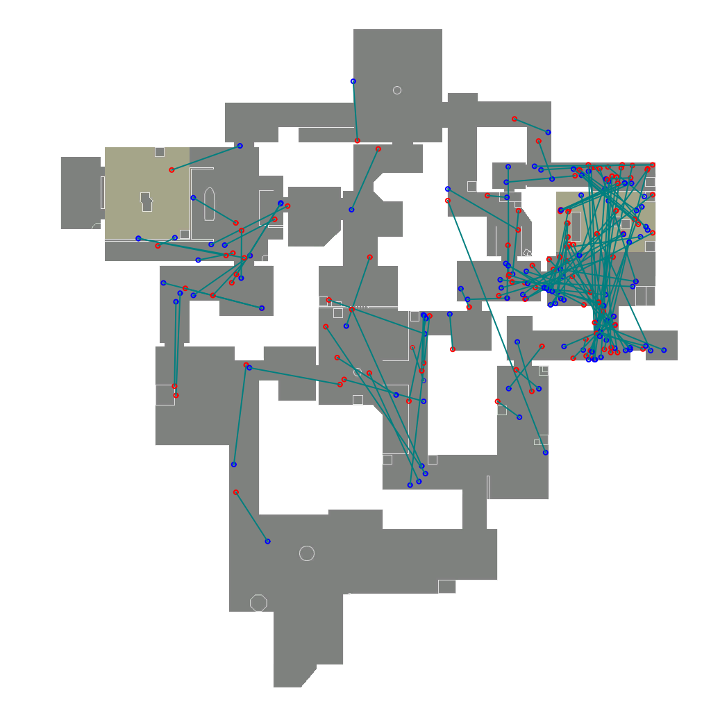
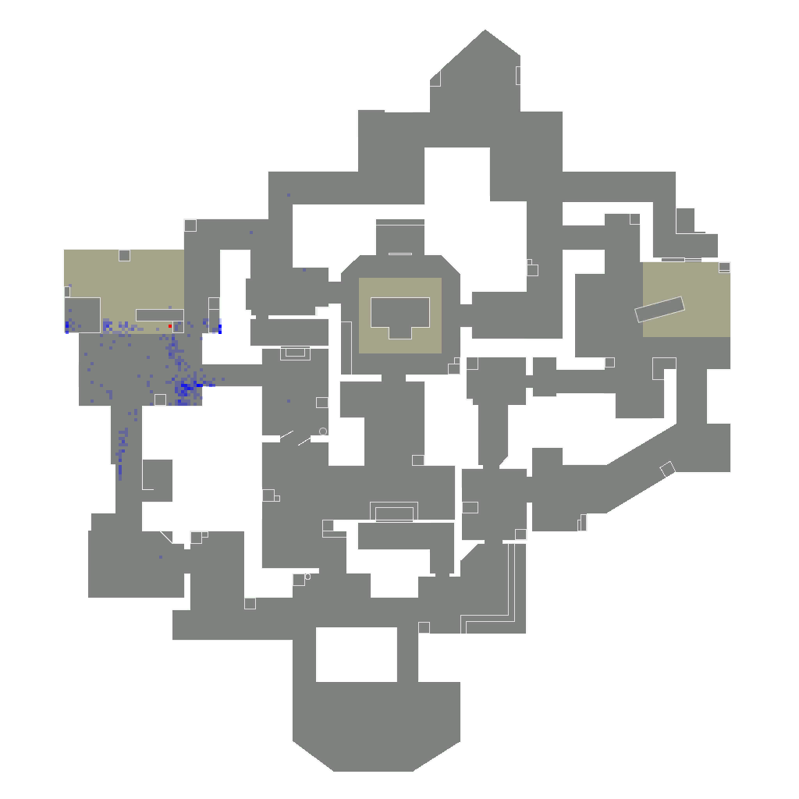

# uno

uno is an unofficial valorant API client.
with uno, you can examine data of valorant play history, and analyze data statistically.






uno provides following features:

- data crawler: you can crawl players' history data
- database: you can cache data you crawled
- visualizer: uno gives you a handy API to map the data to map image
- discord bot: you can run discord bot which helps you visualize play data

---
## Usage

follow the instructions below.
you will need a database to store play history.
uno currently uses a portable database called [shockv](https://github.com/delihiros/shockv).

For more information please take a look at `/examples` directory.

```
git clone github.com/delihiros/shockv
cd shockv
go build -o shockv
./shockv server start

git clone github.com/delihiros/uno
cd uno
go run ./examples/heatmap/main.go
```

Please note that this project is for experiment purpose and does not guarantee anything.
Please use at your own risk.
